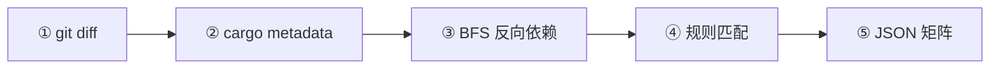
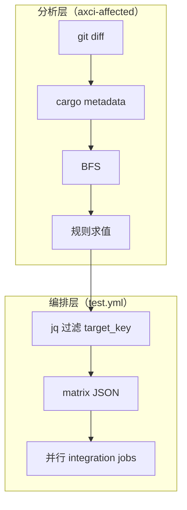

> **来源快照**（权威以 axci 仓库为准）：`docs/工作原理.md`

---

# axci 依赖感知：工作原理

本文说明 **自动选择集成测试目标** 的端到端原理：数据如何流动、各步骤产出什么、规则如何合并，以及与 CI 编排的关系。

更偏「配置与接入」的通用设计见 axci 仓库内 `dependency-aware-testing.md`；AxVisor 案例见 `axvisor-case-study.md`。

---

## 1. 要解决什么问题

组件仓库在 CI 中往往有多类测试目标（不同 QEMU 配置、物理板卡、多架构等）。每次 push 若**全量**执行，耗时长、排队多；若**手工**收窄范围，容易漏测下游依赖。

axci 用同一套流程：**根据 git 变更 + Rust 依赖图 + 可配置规则**，自动得出「本次应跑哪些逻辑目标」，再交给 GitHub Actions 生成并行矩阵。

---

## 2. 三层结构

| 层级 | 职责 | 典型位置 |
|------|------|----------|
| **规则层** | 描述路径/crate 与测试目标的映射、全量/跳过策略 | `configs/test-target-rules.json` 或组件内 `.github/axci-test-target-rules.json` |
| **分析层** | 执行 git diff、`cargo metadata`、反向依赖 BFS、规则求值 | `axci-affected`（首选）、`scripts/affected_crates.sh` + `tests.sh` 回退 |
| **编排层** | 将逻辑目标转为 matrix JSON、触发并行 job | `.github/workflows/test.yml` 的 detect job |

分析层输出是**与具体 job 参数无关**的目标 key 列表（如 `axvisor-qemu-aarch64-arceos`）；编排层再把这些 key **展开**为 `matrix.include` 所需的字段（`vmconfigs`、`runner_labels_json` 等）。

---

## 3. 五步数据流（核心）

### ① 变更文件列表（git diff）

- **输入**：基线引用 `base_ref`（如 `origin/main`）。
- **行为**：`git diff --name-only <base_ref>`；若失败则尝试 `HEAD~1`。也可由外部传入变更路径列表（等价）。
- **输出**：变更文件路径列表。

### ② Crate 归属（cargo metadata + 前缀匹配）

- **输入**：上一步的路径列表；仓库根 `Cargo.toml` 所在 workspace。
- **行为**：
  - 执行 `cargo metadata`（需完整 resolve，**不要**加 `--no-deps`）。
  - 对每个 workspace 成员，由 `manifest_path` 推出 crate **根目录**（相对 workspace 根）。
  - 对每个变更文件，按路径做 **最长前缀匹配**，归入某一 crate；根为 `.` 的包作为兜底。
- **输出**：
  - `changed_crates`：直接因文件变更涉及的 crate；
  - `file_to_crate`：路径 → crate 名（供「crate + 路径」联合规则使用）。

### ③ 反向依赖扩散（BFS）

- **输入**：`cargo metadata` 的 resolve 图；`changed_crates`。
- **行为**：
  - 对 resolve 中每个节点，根据其 `deps` 建立 **反向边**：「被依赖 crate → 依赖它的 workspace 成员」。
  - 从 `changed_crates` 出发对反向图做 **BFS**，收集所有可达的 workspace crate。
- **输出**：`affected_crates`（包含直接变更的 crate 及其下游依赖者）。规则里 `direct_only: false` 时使用该集合。

### ④ 规则匹配（选择逻辑目标）

- **输入**：变更路径、`changed_crates`、`affected_crates`、`file_to_crate`；规则文件 JSON。
- **行为概要**（求值顺序与实现一致）：
  1. 若无变更 → `skip_all`。
  2. 若**所有**变更文件均命中 `non_code`（目录/后缀/固定文件名）→ `skip_all`。
  3. 若命中 `run_all_patterns` 且未被 `run_all_exclude_patterns` 排除 → **全量**（见 `target_order`）。
  4. 若 `changed_crates` 与 `run_all_crates` 有交集 → **全量**。
  5. 否则在「非全量」分支下合并：
     - `selection_rules`：仅看**路径**模式；
     - `crate_rules`：看 crate 名 + `direct_only`；
     - `crate_path_rules`：同一变更文件需同时满足 crate 与 `path_patterns`；每个文件对 `crate_path_rules` **按顺序**匹配，**命中第一条后对该文件停止**。
  6. 若需全量，或合并后选中集合为空，则最终目标为 `target_order` 中**全部** key；否则为 `target_order` 与选中集合的**交集**（顺序遵循 `target_order`）。
- **输出**：`{"skip_all": bool, "targets": ["target_key", ...]}`。

规则字段详解见 axci 仓库内 `configs/test-target-rules.json` 旁白及 `dependency-aware-testing.md` 第 4 节。

### ⑤ JSON 矩阵（CI 并行 job）

- **输入**：引擎输出的 `targets`（及 `skip_all`）；workflow 内预置的「全量候选行」（含 `target_key`）。
- **行为**：detect job 用 `jq` 等按 `target_key` **过滤**出要执行的行，生成 `axvisor_matrix`、`starry_matrix` 等 JSON，写入 job output。
- **输出**：`matrix.include: ${{ fromJson(...) }}`，每个元素对应一个并行 job（含 runner、构建参数等）。

---

## 4. 端到端示意图

---

## 5. 回退与一致性

- **首选**：预编译的 `axci-affected`，输出标准 JSON。
- **回退**：Bash + `jq` + `scripts/affected_crates.sh`，在无法构建引擎时仍能给出相近结果。
- **回归**：`scripts/regress_auto_target.sh`（可加 `--explain`）用于固定用例验证选择逻辑。

---

## 6. 明确不覆盖的行为（避免误解）

- **仅按文件路径粒度使用 git**：不解析 diff 内容；**仅改注释**仍视为该文件变更，不会自动当作「无代码变更」。
- **`non_code`** 仅按路径规则（目录、扩展名、文件名），不按语义。
- **Starry / Axvisor** 等在 matrix 中的具体字段由 workflow 定义；引擎只产出**逻辑 target key**。

---

## 7. 相关文件速查

| 路径 | 说明 |
|------|------|
| `axci-affected/src/engine.rs` | 规则解析、git、cargo、BFS、输出 |
| `scripts/affected_crates.sh` | 与引擎对齐的 Bash 版 crate/affected 计算 |
| `configs/test-target-rules.json` | 默认规则示例 |
| `.github/workflows/test.yml` | detect job 与 matrix 构造 |

---

## 8. 延伸阅读

- axci 仓库：`dependency-aware-testing.md`、`axvisor-case-study.md`、`README.md`（Test 与本地 `--auto-target`）
